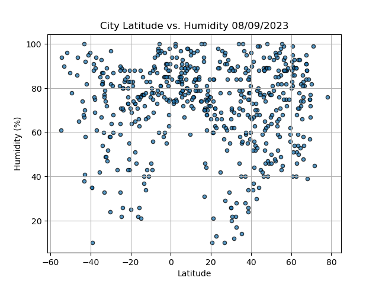

# Python_ApI_Challenge

## Weather and Vacation Analysis

In This project we analyze weather data of over 500 cities . Find  the relationship between weather variables and the latitude of the cities. Analyzed data to plan future vacations by selecting ideal weather conditions for our trip.  And after all inding hotels in the cities that meet our conditions.

### Part 1: WeatherPy

To fulfill the first requirement, you use the OpenWeatherMap API to retrieve weather data from the cities and citipy Python library. We create a Python script to visualize the weather in more then  500 cities of varying distances from the equator . 

We create scatter plots to showcase the following relationships:

* Latitude vs. Temperature

 

*  Latitude vs. Humidity

 

* Latitude vs. Cloudiness

 

- Latitude vs. Wind Speed

 

We also compute linear regression for each relationship, separating the plots into Northern Hemisphere (greater than or equal to 0 degrees latitude) and Southern Hemisphere (less than 0 degrees latitude).

### Part 2: VacationPy

To fulfill the second requirement, you  use your weather data to plan future vacations by using Jupyter notebooks, the geoViews Python library, and the Geoapify API. 
We Create a map that displays a point for every city in the city_data_df DataFrame. The size of the point should be the humidity in each city.

 

We narrow down the city_data DataFrame to find our ideal weather conditions and use the Geoapify API to find the first hotel located within 10,000 meters of our coordinates. 

 

